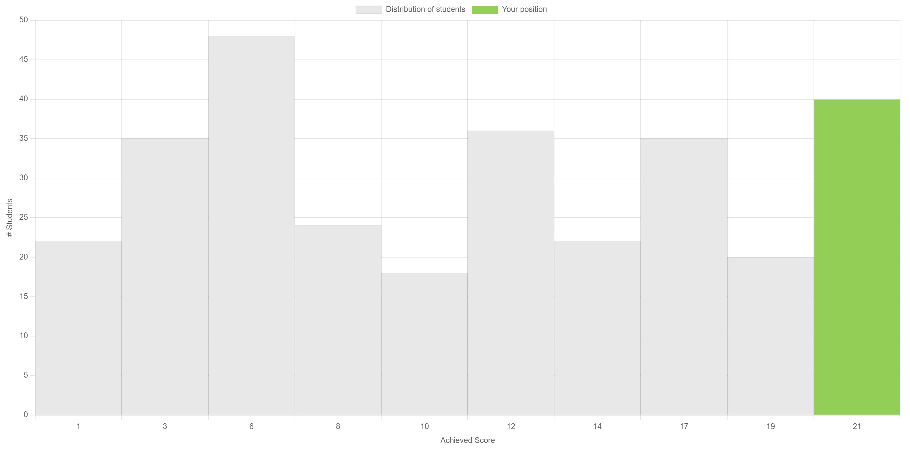

# learning-haskell
My Haskell code for "252-0058-00L Formal Methods and Functional Programming" at ETH Zurich, Spring 2022. Note that this repo only covers 25% of the course (FP coding exercises). Personally I think another 25% goes to proof of FP correctness, and the other half is in FM (formal methods).

## Topics Covered

- Basic Syntax, Lazy Evaluation, Pattern Matching
- List Comprehension
- Higher Order Functions (map, filter, zip, fold, curry, composition...)
- Types and Typeclasses
- FP Implementation of Algorithms (like quicksort)
- I/O, Parsers and (a bit of) Monads

## Resources

See the [course website](https://infsec.ethz.ch/education/ss2022/fmfp.html) for optional literature (I only read [Learn you a Haskell for great good!](http://learnyouahaskell.com/chapters)).

## My Top 3 Favourites

1. Week 7 Assignment 3: [Regular Expressions](week-7\exercises\asm3_regular_expressions\Regexp.md)
2. Week 4 Assignment 1: [Deterministic Finite Automata (DFA)](week-4\exercises\asm1_dfa\DFA.md)
3. Week 6 Assignment 2: [N Queens Problem](week-6\exercises\asm2_queens\NQueens.md)

## Exercise Score Distribution

- Exercises are due weekly, and cover contents up to that week
- Exercises are optional (they don't contribute directly to course grade)
- I got 21/22 out of all exercises (I couldn't solve the very last part of the very last question - hope it explains why it's my top favourite!)

